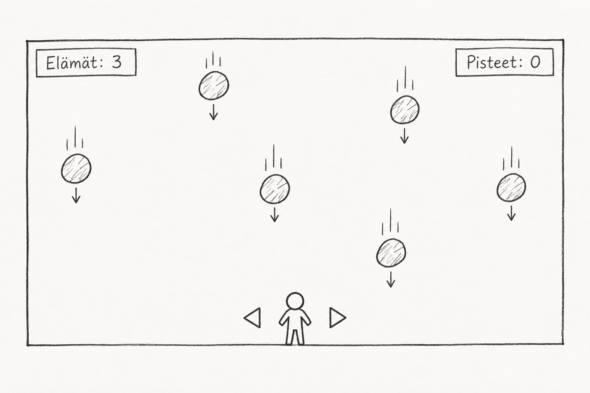

# Harjoitustyön suunnitelma

## Tietoja 

Tekijä: Juho Sointula

Työ git-varaston osoite: <https://github.com/hirottaja/ohj1ht.git>

Pelin nimi: Väistöliike

Pelialusta: Windows

Pelaajien lukumäärä: 1

## Pelin tarina

Pelaaja on jäänyt yksin sortuvaan louhokseen. Kalliosta irtoaa jatkuvasti kiviä, jotka putoavat kohti pelaajaa. Ainoa keino selvitä on liikkua sivuttain ja väistää putoavat kivet niin kauan kuin mahdollista.

## Pelin idea ja tavoitteet

Pelaaja ohjaa hahmoa vaaka-akselilla kentän alareunassa nuolinäppäimillä. Yläreunasta putoaa satunnaisin väliajoin ja satunnaisiin kohtiin kiviä, jotka liikkuvat tasaisella nopeudella alaspäin. Kivet ovat fysiikkaolioita, joita säilytetään listassa. Listan avulla seurataan kaikkien ruudulla olevien kivien törmäyksiä pelaajaan ja poistetaan ruudun alareunan ohi pudonneet kivet.

Jos kivi osuu pelaajaan, pelaaja menettää yhden elämän. Pelaajalla on kolme elämää. Kun elämät loppuvat, peli päättyy ja ruudulle tulostuu lopullinen pistemäärä. Pisteitä kertyy sitä enemmän, mitä kauemmin pelaaja pysyy hengissä. Tavoitteena on kerätä mahdollisimman suuri pistemäärä ennen kuin elämät loppuvat.

## Hahmotelma pelistä

(Esimerkkikuva luotu tekoälyllä)

## Toteutuksen suunnitelma

Viikko 1

- Pelaajahahmon luonti ja liikkuminen näppäimistöllä
- Yhden kiven luonti ja putoaminen kentällä

Viikko 2

- Kivien satunnainen ja jatkuva syntyminen ajastimen avulla ja kivet laitetaan listaan
- Kivilistan käsittely. Pudonneiden kivien poisto ja törmäyksen tunnistus
- Elämien ja pisteiden laskenta, pelin päättyminen

Jos aikaa jää

- Vaikeustason kasvu ajan myötä (kivien putoamisnopeus ja tiheys kasvavat)
- Vaikeustason kasvaessa myös pisteiden kertyminen kasvaa
- Grafiikan ja äänien viimeistely
- Parhaan tuloksen (highscore) tallennus
- Powerupit (Lisäelämä, kilpi, putamisnopeuden hidastus)
